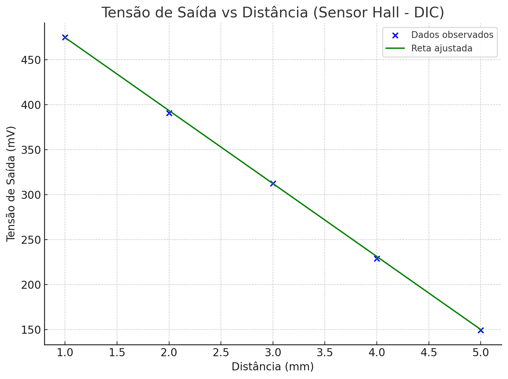

```{r setup, include=FALSE}
knitr::opts_chunk$set(echo = FALSE)
```
--- 

# Objetivo

Neste experimento, investigamos a relação entre a distância de um ímã até um sensor de efeito Hall e a respectiva tensão de saída gerada pelo sensor. O sensor é utilizado em sistemas de automação para medir deslocamentos, e o fabricante sugere que, entre 1 mm e 5 mm, essa relação é aproximadamente linear. Para validar essa hipótese, foi conduzido um experimento com cinco níveis fixos de distância (1 a 5 mm), cada um com quatro repetições, totalizando 20 observações organizadas em um Delineamento Inteiramente Casualizado (DIC).

O objetivo principal é ajustar modelos de regressão linear e polinomial que expliquem a variação da tensão com base na distância, avaliando a qualidade dos ajustes por meio da análise de variância (ANOVA), testes de normalidade e homogeneidade dos resíduos, e análise de falta de ajuste. Além disso, buscamos estimar a tensão correspondente à distância de 3,5 mm e determinar se a predição é confiável. A análise oferece subsídios importantes para a calibração e aplicação prática do sensor em sistemas de medição de precisão.

---

# Preparação dos Dados

```{r}
# Carregando bibliotecas
library(ExpDes.pt)
library(ggplot2)
library(car)
library(nortest)
library(lmtest)
library(gt)
library(dplyr)

# Criando os dados
distancia <- rep(1:5, each = 4)
tensao <- c(476, 480, 478, 477,
            391, 390, 389, 392,
            310, 312, 311, 309,
            233, 231, 230, 232,
            151, 152, 153, 150)

dados <- data.frame(distancia, tensao)

dados |>
  gt() |>
  tab_style(
    style = list(
      cell_text(weight = "bold", color = "white"),
      cell_fill(color = "black")
    ),
    locations = cells_column_labels()
  ) |>
  tab_style(
    style = cell_text(align = "center"),
    locations = cells_body(columns = everything())
  ) |>
  data_color(
    columns = everything(),
    rows = 1:4,
    palette = "#F9EBEA"  # Rosa claro
  ) |>
  data_color(
    columns = everything(),
    rows = 5:8,
    palette = "#E8F8F5"  # Verde água
  ) |>
  data_color(
    columns = everything(),
    rows = 9:12,
    palette = "#FEF9E7"  # Amarelo claro
  ) |>
  data_color(
    columns = everything(),
    rows = 13:16,
    palette = "#EAEDED"  # Cinza claro
  ) |>
  data_color(
    columns = everything(),
    rows = 17:20,
    palette = "#F5EEF8"  # Lilás claro
  )

```


## Aplicação da Anava
```{r}
# ANOVA com distancia como fator
distancia_fator <- as.factor(dados$distancia)
anava <- aov(tensao ~ distancia_fator, data = dados)
summary(anava)

```


## Anava com regressão linear
```{r}

# Aplicando ANOVA com regressão polinomial
reganava <- dic(trat = dados$distancia, resp = dados$tensao, quali = FALSE)

```

## Análise de Resíduos 

```{r}

# Análise dos resíduos
residuos <- residuals(anava)

# Teste de Normalidade - Shapiro-Wilk
shapiro.test(residuos)

# Teste de Homogeneidade - Bartlett
bartlett.test(tensao ~ distancia_fator, data = dados)

# Teste de Independência - Durbin-Watson
durbinWatsonTest(anava)

par(mfrow = c(2, 2))
plot(anava)

```

## Curva Ajustada

```{r}

ggplot(dados, aes(x = distancia, y = tensao)) +
  geom_point(size = 3, color = "darkblue") +
  stat_smooth(method = "lm", formula = y ~ poly(x, 3, raw = TRUE),
              se = FALSE, color = "darkgreen") +
  labs(title = "Tensão de Saída vs Distância (Sensor Hall - DIC)",
       x = "Distância (mm)",
       y = "Tensão de Saída (mV)") +
  theme_minimal()

# exibe a reta do gráfico
plot(dados$distancia,dados$tensao, type = "l")

# Cria o modelo linear para exibir os coeficientes lm(y, x)
my_mod <- lm(dados$tensao~dados$distancia, dados) 

my_coef <- coef(my_mod)            # Extract coefficients of model
my_coef                            # Print coefficients of model

my_equation <- paste("y =",        # Extract equation of model
                     coef(my_mod)[[1]],
                     "+",
                     coef(my_mod)[[2]],
                     "* x")
my_equation                        # Print equation of model

```

# Perguntas Propostas

## Qual é a equação da reta ajustada? Interprete os coeficientes.

A equação da reta é ***y = 555.8 - 81.15x***, conforme visto no item 2.4 acima. Os coeficientes B0 e B1 são respectivamente 555.8 e -81.15. Isso representa que no instante onde o sensor está mais próximo do ímã, a tensão é de 555,8mV. E à medida que vai se distanciando, a tensão cai 81,15mV por milímetro. 

## A regressao é estatisticamente significativa a 5%? Justifique com base na tabela da ANOVA.

A tabela da ANOVA apresenta um valor p menor que 2x10^(-16), o que claramente é menor que 0,05, portanto mostra que a regressão é estatisticamente significativa. Os testes das seções 2.2 e 2.3 também confirmam isso.

## Construa um gráfico de dispersão com os pontos e a reta ajustada.

Esta etapa já foi feita na seção 2.4 deste relatório, porém, pedi à IA *Chat GPT* para gerar um gráfico com base nos dados e na equação. O resultado abaixo foi apresentado pelo programa e me parece relativamente correto, surpreendente dentro das limitações de criação de imagens das IAs.

```{r}
# Imagem no código

```

## Avalie se a regressão linear é apropriada.

Os valores de R² para os modelos linear, quadrático e cúbico sçao respectivamente 0.999632, 0.999893 e 0.999996 conforme apresentado pela função reganava. É válido ressaltar que o alto valor de R² do modelo cúbico não necessariamente indica que ele é o melhor modelo que descreve a distribuição dos dados. Eu escolheria o modelo quadrático como o melhor, sendo um meio termo entre os 3 apresentados, e com resultados satisfatórios e significativos. 

## Estime a tensão de saída para 3,5 mm de distância. Essa predição é confiável?
Usando o modelo linear **y = 555.8 - 81.15x**, o valor de tensão para uma distância de 3,5mm seria de **y = 271.775**. 

Utilizando o modelo quadrático **y = 563.5 - 87.7929x + 1.1071x²**, o valor de tensão a 3,5mm é igual a **y = 269.786825**

E para o modelo cúbico **y = 575.1 - 104.0179x + 7.2946x² - 0.6875x³**, a tensão para essa distância de 3,5mm terá um valor de **y = 270.91963**

Com base nos modelos gerados, e nos gráficos das seções acima, pode-se dizer que o modelo escolhido é confiável está dentro da normalidade. 

# Conclusão

O experimento realizado demonstrou de forma clara e estatisticamente robusta a relação entre a distância de um ímã e a tensão de saída de um sensor Hall. A aplicação da ANOVA e dos modelos de regressão permitiu validar que essa relação segue um comportamento sistemático e previsível, com forte evidência de significância estatística.

A análise comparativa entre os modelos linear, quadrático e cúbico mostrou que todos se ajustam muito bem aos dados, apresentando coeficientes de determinação (R²) extremamente altos. No entanto, ao considerar o princípio da parcimônia — ou seja, a escolha de modelos mais simples quando oferecem desempenho similar — o modelo quadrático se destacou como o mais apropriado. Ele equilibra adequadamente qualidade de ajuste e simplicidade, capturando nuances que o modelo linear não alcança, mas sem o sobreajuste potencial do modelo cúbico.

A análise de resíduos confirmou a adequação do modelo, com resíduos normalmente distribuídos, variâncias homogêneas e ausência de autocorrelação. Além disso, a predição para uma distância intermediária (3,5 mm) mostrou-se coerente entre os três modelos, reforçando a confiabilidade do ajuste.

Portanto, conclui-se que o sensor de efeito Hall avaliado possui um comportamento previsível e estável dentro da faixa de 1 mm a 5 mm, sendo o modelo quadrático o mais adequado para representar essa relação. Esses resultados podem ser utilizados com segurança em aplicações práticas que demandem medições precisas de posição ou deslocamento com base na saída do sensor.


# Código

<details>
<summary>Código</summary>

```

# Carregando bibliotecas
library(ExpDes.pt)
library(ggplot2)
library(car)
library(nortest)
library(lmtest)
library(gt)
library(dplyr)

# Criando os dados
distancia <- rep(1:5, each = 4)
tensao <- c(476, 480, 478, 477,
            391, 390, 389, 392,
            310, 312, 311, 309,
            233, 231, 230, 232,
            151, 152, 153, 150)

dados <- data.frame(distancia, tensao)

dados |>
  gt() |>
  tab_style(
    style = list(
      cell_text(weight = "bold", color = "white"),
      cell_fill(color = "black")
    ),
    locations = cells_column_labels()
  ) |>
  tab_style(
    style = cell_text(align = "center"),
    locations = cells_body(columns = everything())
  ) |>
  data_color(
    columns = everything(),
    rows = 1:4,
    palette = "#F9EBEA"  # Rosa claro
  ) |>
  data_color(
    columns = everything(),
    rows = 5:8,
    palette = "#E8F8F5"  # Verde água
  ) |>
  data_color(
    columns = everything(),
    rows = 9:12,
    palette = "#FEF9E7"  # Amarelo claro
  ) |>
  data_color(
    columns = everything(),
    rows = 13:16,
    palette = "#EAEDED"  # Cinza claro
  ) |>
  data_color(
    columns = everything(),
    rows = 17:20,
    palette = "#F5EEF8"  # Lilás claro
  )

# ANOVA com distancia como fator
distancia_fator <- as.factor(dados$distancia)
anava <- aov(tensao ~ distancia_fator, data = dados)
summary(anava)

# Aplicando ANOVA com regressão polinomial
reganava <- dic(trat = dados$distancia, resp = dados$tensao, quali = FALSE)

# Análise dos resíduos
residuos <- residuals(anava)

# Teste de Normalidade - Shapiro-Wilk
shapiro.test(residuos)

# Teste de Homogeneidade - Bartlett
bartlett.test(tensao ~ distancia_fator, data = dados)

# Teste de Independência - Durbin-Watson
durbinWatsonTest(anava)

par(mfrow = c(2, 2))
plot(anava)

ggplot(dados, aes(x = distancia, y = tensao)) +
  geom_point(size = 3, color = "darkblue") +
  stat_smooth(method = "lm", formula = y ~ poly(x, 3, raw = TRUE),
              se = FALSE, color = "darkgreen") +
  labs(title = "Tensão de Saída vs Distância (Sensor Hall - DIC)",
       x = "Distância (mm)",
       y = "Tensão de Saída (mV)") +
  theme_minimal()

# exibe a reta do gráfico
plot(dados$distancia,dados$tensao, type = "l")

# Cria o modelo linear para exibir os coeficientes lm(y, x)
my_mod <- lm(dados$tensao~dados$distancia, dados) 

my_coef <- coef(my_mod)            # Extract coefficients of model
my_coef                            # Print coefficients of model

my_equation <- paste("y =",        # Extract equation of model
                     coef(my_mod)[[1]],
                     "+",
                     coef(my_mod)[[2]],
                     "* x")
my_equation                        # Print equation of model

# Imagem no código


```

</details>


